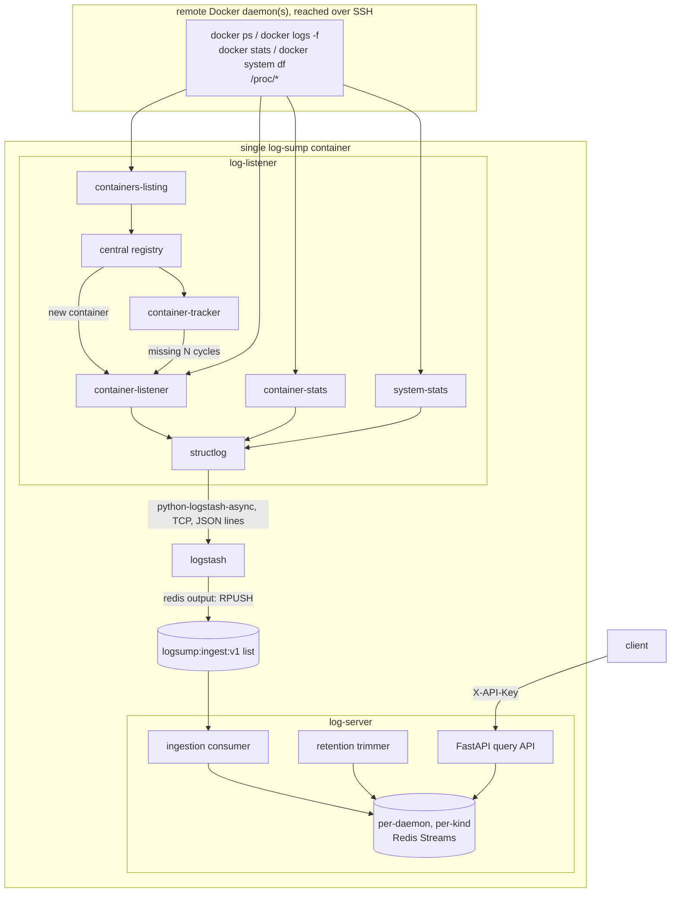

# Architecture

## Overview

A `log-sump` instance is one container image running **four supervised
processes** (`s6-overlay`): `log-listener`, `logstash`, `redis`, and
`log-server`. `log-listener` watches one or more remote Docker daemons over
SSH and streams what it finds through Logstash into Redis; `log-server`
turns Redis into a queryable, authenticated API.



## Components

| Process | Role |
|---|---|
| **log-listener** | Orchestrator (Python/asyncio). Discovers containers per daemon, spawns/stops per-container listeners, tracks liveness, samples resource metrics, emits structured records. |
| **logstash** | Transport + parse layer. Receives records from `log-listener` over TCP and forwards them into Redis. |
| **redis** | Store for records (Redis Streams) with configurable, per-kind retention. |
| **log-server** | Query API for clients (Python/asyncio, FastAPI); consumes Logstash's output into Streams; runs the retention trimmer; serves the daemon catalog behind authentication. |

`log-listener` and `container-listener` are deliberately distinct names: the
former is the whole orchestrator process, the latter is one task per
`(daemon, container)`.

### `log-listener` internal tasks

All of these run as `asyncio` tasks in one event loop, per configured
daemon. Source: `src/log_sump/listener/`.

- **`containers_listing.py`** — one task per daemon. Polls the equivalent
  of `docker ps` on an interval and publishes the current container set to
  the registry.
- **`registry.py`** — in-process shared state per daemon: the latest
  listing, a monotonically increasing `listing_seq`, and per container a
  `last_seen_seq`. New containers fire a callback (`on_new_container`)
  rather than being polled for. Vanished containers are **not** removed
  immediately — that's the tracker's job — so a single flaky `docker ps`
  cycle can't tear down a healthy listener.
- **`container_listener.py`** — one task per `(daemon, container)`. Streams
  `docker logs -f --timestamps <container>`, splits the timestamp from the
  payload, JSON-detects the remainder (a native JSON payload contributes
  its own `level`/`message`/extra fields; anything else becomes a plain
  message with a default level), and ships the resulting `LogRecord`.
- **`container_tracker.py`** — reconciles active listeners against the
  registry; stops a listener once its container has been absent for
  `missing_threshold_cycles` consecutive listings.
- **`container_stats.py`** — one task per daemon. Polls
  `docker stats --no-stream` once per cycle (a single snapshot for every
  running container, not one subprocess per container), normalizes the
  human-readable units to numbers, and emits one `MetricRecord` per
  container.
- **`system_stats.py`** — one task per daemon. Emits daemon/host-level
  metrics (`container_id = "__system__"`): `docker system df` for Docker
  disk usage, plus host CPU/memory/network/disk from `/proc` (read in one
  round trip via `Transport.run_shell`), falling back to a coarse
  container-aggregate proxy if `/proc` is unavailable or fails.
- **`app.py`** — wires the above together per daemon: builds each daemon's
  `Transport`, owns the single dispatcher that routes the registry's
  `on_new_container` callback by `docker_host` (`Registry` only supports one
  callback slot — routing per daemon here, not inside each daemon's own
  setup, is what keeps multi-daemon dispatch from clobbering itself), and
  bounds concurrent listener spawns with one process-wide `asyncio.Semaphore`.

## Data flow

1. **Discovery**: `containers-listing` → `registry.update()` → new
   containers trigger `ListenerManager.spawn()` (bounded by the spawn
   semaphore); `container-tracker` stops listeners for containers absent
   `missing_threshold_cycles` cycles in a row.
2. **Logs**: `container-listener` streams `docker logs -f --timestamps`,
   builds a `LogRecord` per line with a per-listener monotonic `seq`.
3. **Metrics**: `container-stats` (per container) and `system-stats`
   (per daemon, `__system__`) build `MetricRecord`s on their own interval.
4. **Shipping**: every record is serialized to JSON and emitted via a
   dedicated `structlog` logger (`logging_setup.build_records_logger`)
   backed by `python-logstash-async`'s `AsynchronousLogstashHandler` — a
   background thread with a persistent on-disk SQLite buffer, so
   in-flight records survive a `log-listener` restart. The message sent
   is *exactly* the record's JSON, verbatim.
5. **Logstash** (`logstash/pipeline/log-sump.conf`) receives it over its
   `tcp`/`json_lines` input (that's the wire format `python-logstash-async`
   sends), validates it, and forwards the original `message` string
   unmodified via a `redis` output (`RPUSH`) to the `logsump:ingest:v1`
   list — not the enriched Logstash event, so nothing about Logstash's own
   envelope fields (`@timestamp`, `host`, `level`, ...) leaks into what
   `log-server` reads back.
6. **Ingestion** (`log_sump.server.ingest.consumer`): a background task
   inside `log-server` drains that list (`BLPOP` + batched `LPOP`),
   validates each entry against the shared `Record` schema, and `XADD`s it
   into the correct per-daemon, per-kind Redis Stream. Malformed entries
   are logged and dropped here — this is where the pipeline's "enforce
   schema, drop malformed entries" requirement is actually implemented,
   once, in Python (Logstash's own filter only tags-and-drops on parse
   failure; it doesn't duplicate the schema check).
7. **Retention** (`log_sump.server.ingest.trimmer`): a second background
   task periodically `XTRIM`s each stream down to its kind's retention
   horizon.
8. **Query**: `log-server`'s FastAPI app reads directly from the Streams —
   see [API docs](api.md).

## Record schema

Every captured log line and every sampled metric becomes one of two
`Record` variants (`src/log_sump/common/schema.py`),
discriminated by `kind`, sharing common identity fields so logs and metrics
land contiguously on one per-daemon timeline:

| Field | Meaning |
|---|---|
| `kind` | `"log"` \| `"metric"` |
| `docker_host` | daemon identifier |
| `container_name`, `container_id` | from the listing (`"__system__"` for daemon-level metrics) |
| `ts` | event time |
| `seq` | per-source monotonic tie-breaker — `docker_host`/`container_id`/`ts` alone isn't guaranteed unique (two lines can share a sub-second timestamp) |

`kind = "log"` adds `stream` (`stdout`/`stderr`), `level`, `message`,
`fields` (open-ended, from JSON payloads), `raw`. `kind = "metric"` adds
`metric_scope` (`container`/`system`), `cpu_pct`, `mem_used_bytes`,
`mem_limit_bytes`, `mem_pct`, `net_rx_bytes`, `net_tx_bytes`,
`blk_read_bytes`, `blk_write_bytes` (all cumulative counters, matching
`docker stats`' own semantics — not rates), `pids`, `system` (daemon-level
object: Docker disk usage + host figures when available), `source`
(`"docker stats"` \| `"docker system df"` \| `"/proc"` \| `"container-aggregate"`),
`raw`.

The record's unique ID is the Redis Stream entry ID Redis assigns on
`XADD` (auto-generated, time-ordered) — not a computed hash.

## Redis data model

- **Ingest list**: `logsump:ingest:v1` — a plain list, since Logstash's
  `redis` output has no native `XADD` mode. Versioned so a future schema
  change could run a new version alongside the old one.
- **Per-daemon, per-kind streams**: `logsump:stream:{docker_host}:log` and
  `logsump:stream:{docker_host}:metric` (`redis_keys.py`).
  - **Not per-container**: container IDs churn on every redeploy/restart, so
    a per-container stream scheme would accumulate stale, permanently-empty
    stream keys (`XTRIM` doesn't delete the stream key itself). Per-daemon
    is bounded by the small, static daemon count; `container_id` stays a
    field on each entry, filtered post-`XRANGE`.
  - **Split by kind**: `retention_days` and `metrics_retention_days` are
    independently configurable. A single mixed stream trimmed to the `MAX`
    of the two would leave expired-by-kind rows physically present; two
    streams let `XTRIM MINID` enforce the exact horizon per kind, and
    `log-server`'s `/records` endpoint reads both and merges by `ts` when
    both kinds are requested — that's the "contiguous timeline" requirement.
- **Retention is exact, not approximate**: `XTRIM MINID` is called *without*
  the `~` (approximate) flag. This was a real bug caught by testing against
  a genuine Redis rather than `fakeredis`: approximate `MINID` trimming is
  only a hint, and Redis defers the actual delete until enough entries pile
  up past the boundary to make a bulk radix-tree-node removal worth it — at
  low/moderate stream volume, nothing gets trimmed at all. Unlike `MAXLEN`
  trimming (which needs the stream's total length), `MINID` trimming is
  already an amortized walk of just the removed entries, so exactness here
  doesn't cost what approximate trimming was meant to save.

## Transport abstraction

Every command that reaches a daemon's host (`docker ps`, `docker logs -f`,
`docker stats`, `docker system df`, `/proc` reads) goes through a
`Transport` (`src/log_sump/common/transport.py`).
The default is the Docker CLI reached over SSH
(`ssh <user>@<host> docker ...`), run via `asyncio.create_subprocess_exec`
so the event loop is never blocked; a `LocalTransport` (no `ssh` wrapper)
lets the exact same listener code run against a developer's own Docker
socket for local dev/tests. Kept behind this interface so a different
transport (e.g. `aiodocker` over TLS) could swap in without touching call
sites.

Compound shell commands (used for the single-round-trip `/proc` read) go
through `Transport.run_shell()`, not a plain multi-argument `argv` list —
another real bug caught along the way: OpenSSH joins *all* trailing
arguments after the destination into one string before handing it to the
remote shell, so `ssh host sh -c "cat a; cat b"` (passed as three separate
argv elements) gets silently rejoined and mis-parsed remotely. `run_shell`
gives each transport its own correct shape: a single argument for SSH (ssh's
own remote-command handling already implies a shell), `["sh", "-c", script]`
for local exec (which has no implicit shell at all).

## Auth model

Two tiers, both backed by the same Redis-stored API-key mapping
(`log_sump.common.auth`, `RedisApiKeyAuthBackend`):

- **Daemon-scoped** (`/catalog`, `/records`): the key must map to a set of
  permitted `docker_host` values, and the specific daemon being queried
  must be in that set.
- **Any valid key** (`/admin/redis/command`, the read-only Redis inspection
  endpoint): the key just has to be *known* — this endpoint isn't scoped to
  a daemon's records at all. Its safety comes from a fixed allowlist of
  read-only Redis commands (no writes, no `FLUSHALL`/`CONFIG`/`SHUTDOWN`,
  regardless of who's asking), documented in
  `log_sump.server.redis_inspect` — not from a separate elevated
  credential tier, which would add provisioning overhead without changing
  what a compromised key could actually do here.

## Packaging & supervision

Single image (`docker/Dockerfile`, multi-stage: `uv`-built venv → runtime
with `redis-server`, `openssh-client`, and Logstash's official tarball,
which bundles its own JDK). Four processes under **s6-overlay**
(`supervisor/s6-rc.d/`), with explicit start-order dependencies:

```
redis ← logstash ← log-listener
redis ← log-server
```

On `SIGTERM` (e.g. `docker stop`), s6-rc stops services in reverse
dependency order — `log-server`/`log-listener` first, then `logstash`, then
`redis` last — each given time to exit cleanly: `log-server`'s FastAPI
`lifespan` cancels its background ingestion/trimmer tasks and closes its
Redis connection; `log-listener` installs its own `SIGTERM`/`SIGINT`
handler (a bare `asyncio.run()` doesn't get one for free — only `SIGINT`
is special-cased by Python, as `KeyboardInterrupt`) to cancel its tasks,
which kills any in-flight `docker logs -f` subprocesses, and flushes the
`python-logstash-async` buffer before exiting.

## Known limitations

- Per-daemon live reachability status (spec: "surface per-daemon
  reachability status") is a documented seam, not built — `/catalog`
  currently reflects the static config, not live `docker ps` success/failure.
- The container runs as root; dropping to a non-root user is a reasonable
  follow-up, not done in this pass.
- `python-logstash-async` has a macOS-only bug in its socket-close logic
  (`fcntl.ioctl(..., termios.TIOCOUTQ, ...)`, a Linux-only ioctl) that
  surfaces during local dev on macOS; harmless in the actual deployment
  target (a Linux container).
